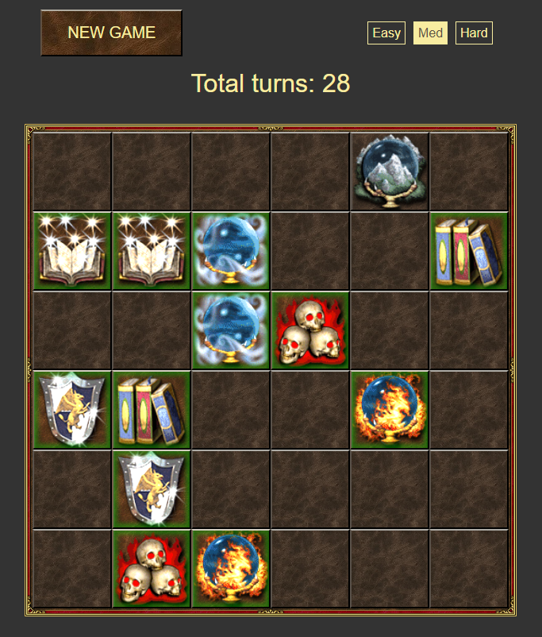

# Memory game

## Rules

The goal is to open all cards for fewer turns count as possible. You need to click one `card` and then another one. If cards have the same image they stay open, otherwise, they flip back. The game is over when all cards will be opened. The turns counter increases by 1 after two clicks, it's not whether dependency cards were matched or not.

`It's recommended to use Desktop or Tablet for better experience`

## Modes

- **Easy** - `4x4` board with `4` different images
- **Medium** - `6x6` board with `8` different images
- **Hard** - `8x6` board with `16` different images

## Live preview

[Heroes 3 memory game](https://valerii-frontend.github.io/memorize-game/)

## Future plans

- High score table
- Different images theme
- Additional gaming modes
